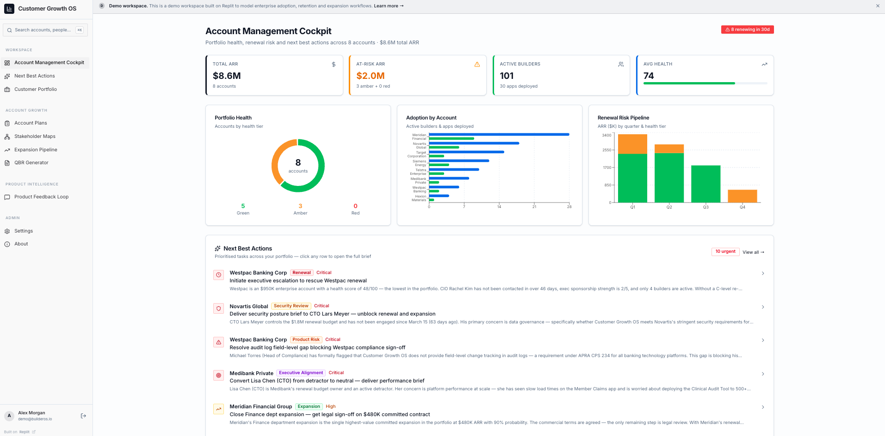

# Customer Growth OS

> An AI-native operating system for enterprise Account Management — portfolio health,
> renewal risk, expansion signals, and next-best-actions in one workspace.

🔗 **Live demo** → https://customer-adoption-hub--davidzelee.replit.app

---

## Why this exists

Most Account Management still runs on spreadsheets, BI dashboards bolted onto Salesforce,
and CSM intuition. For a senior AM owning 8–30 enterprise accounts across multiple verticals,
that stack collapses under operational reality: real-time portfolio health, multi-stakeholder
mapping, regulatory blockers across jurisdictions, expansion pipeline tracking, and renewal
narrative generation.

Customer Growth OS is the operating system I'd want if I were carrying that book — and the
abstract operating model I'd want to give an AI-native company's entire post-sale team.

## What it does

The product is organised around three operating layers:

**Workspace — the daily operating layer**
- **Account Management Cockpit** — portfolio ARR, at-risk ARR, active builders, health
  scoring; renewal risk pipeline by quarter; adoption by account
- **Next Best Actions** — prioritised tasks across the portfolio with full context
  (stakeholders, regulatory blockers, deal mechanics)
- **Customer Portfolio** — account-level deep dives

**Account Growth — the strategic layer**
- **Account Plans** — structured account strategy
- **Stakeholder Maps** — buying-committee and detractor/champion mapping
- **Expansion Pipeline** — in-year expansion tracking
- **QBR Generator** — AI generates executive-ready Quarterly Business Reviews from account
  data: executive summary, adoption progress, business value delivered, risks & mitigations,
  expansion opportunity, and next-quarter action plan. Regenerate is surfaced as a
  first-class action

**Product Intelligence — the feedback layer**
- **Product Feedback Loop** — AI clusters customer friction by theme (Missing Feature, UX,
  Performance, Pricing, Integration, Security), computes ARR-weighted priority scores from
  issue ARR × reach × severity, and surfaces themes via an Impact-vs-Reach matrix for
  product prioritisation

## What it demonstrates

This project is intended to prove four things at once:

1. **Senior AM craft** — the modelled accounts, regulatory blockers (e.g. APRA CPS 234
   audit-log requirements), and stakeholder dynamics reflect 10+ years running real strategic
   portfolios at Salesforce/Tableau
2. **Multi-vertical fluency** — 8 modelled accounts span banking (Westpac), pharma (Novartis),
   industrial (Siemens, Hexion), healthcare (Medibank), telecom (Telstra), and retail (Target)
3. **AI-native product thinking** — Replit AI / Replit Agent powers QBR generation, Next
   Best Action prioritisation, and product feedback clustering; the app demonstrates how
   AI generation fits naturally into post-sale workflows rather than being bolted on
4. **Builder velocity** — built end-to-end on Replit without an engineering team

## Modelled portfolio at a glance

| Metric | Value |
|---|---|
| Total ARR under management | $8.6M |
| Accounts | 8 strategic |
| Active builders | 101 across 30 apps deployed |
| Average portfolio health | 74/100 |
| At-risk ARR | $2.0M (3 amber) |
| Renewals in 30d | 8 |

## Tech stack

| Layer | Choice |
|---|---|
| Build platform | Replit |
| AI | Replit AI / Replit Agent |
| Data | Synthetic — all account names, financials, stakeholder details are fictional |

## What's next

- Live CRM integration (Salesforce, HubSpot) replacing synthetic data
- Multi-AM workspace with portfolio handoff workflows
- Outbound expansion play sequencing tied to renewal calendar
- Voice surface — daily portfolio briefing via TTS (currently in sister project SuccessOS)

## Related work

- **[SuccessOS](https://github.com/DavLMZ/successos-elevenlabs)** — the same operating model
  applied specifically to ElevenLabs, with voice agent integration via ElevenLabs API

## About me

David Le Maistre Zelee — AI-Native GTM & Customer Growth operator. Ex-Salesforce/Tableau
($54.5M portfolio, 113% retention attainment, scaled EMEA CS 3→40+). Based in London,
fluent in French and English.

[LinkedIn](https://www.linkedin.com/in/davidzelee) · [Email](mailto:david.zelee@gmail.com)

---

*All customer data is synthetic. Built on Replit.*
